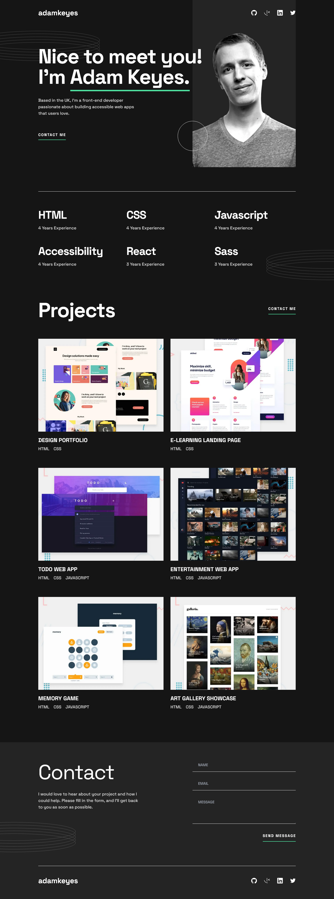

# Frontend Mentor - Single-page developer portfolio solution

This is a solution to the [Single-page developer portfolio challenge on Frontend Mentor](https://www.frontendmentor.io/challenges/singlepage-developer-portfolio-bBVj2ZPi-x). Frontend Mentor challenges help you improve your coding skills by building realistic projects.

### Screenshot

### Links

- Solution URL: [Solution URL here](https://github.com/NDK1195/single-page-developer-portfolio)
- Live Site URL: [Live site URL here](https://ndk1195.github.io/single-page-developer-portfolio/)

### Built with

- HTML5
- Tailwind CSS
- Javascript
